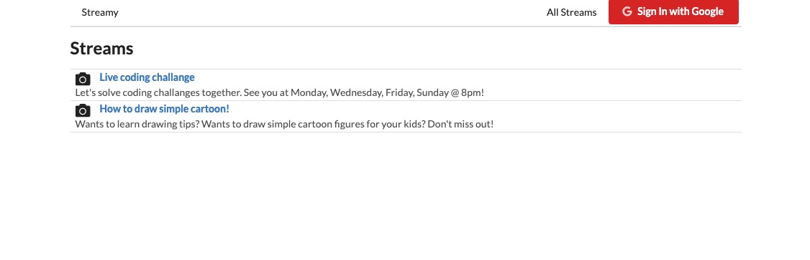

# Streamy

Streamy is a clone of the main cord of web application twitch.tv which allows users to record videos on desktop and stream it alive on viewers while other users can view the videos. Streamy integrates React Router, Redux, axios, lodash, redux-form, and redux-thunk. Streamy also utilizes Google Oauth API to allows user to sign in and out. Flv.js handles the video streaming side of the application and allows users to user OBS to stream videos alive. 



Heroku Link: https://streamy-react.herokuapp.com/

## Getting Started
### Prerequisites

What things you need to install the software:

* [React]


### Installation

First, download and install React - https://reactjs.org/

After you have successfully installed the React library. Download this project and change to the project directory.
```sh
$ cd Streamy-client
```

Install packages that are required for this project.

```sh
$ npm install --save node_modules axios react-dom react-redux react-router-dom react-scripts redux-form redux-thunk
```

Start the project

```sh
$ npm start
```

Note: You might interact with errors for missing packages if this is the first time starting this project. Follow the terminal error instruction to install other neccessary packages. 

React should automatically pop the web browser open with the project running on localhost:3000. If not, simply open your browser and search localhost:3000 to access this project. 